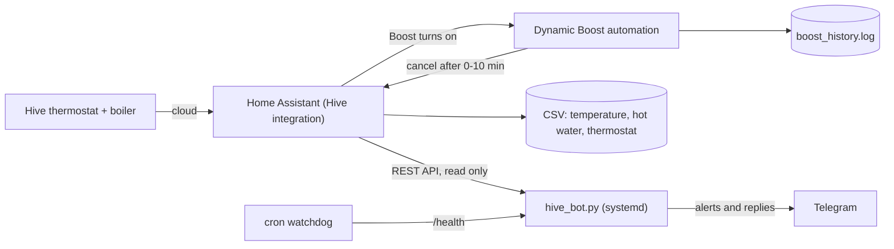

# Hive Dynamic Boost Control for Home Assistant

**Hive's Boost button always heats for 30 minutes — whatever the room temperature is.
This makes Boost last only as long as the house actually needs, logs every press, and
sends you a Telegram message when the house is too warm.**


[Why](#why-this-exists) · [What you get](#what-you-get) · [See it](#see-it) ·
[How it fits together](#how-it-fits-together) · [Quick start](#quick-start) ·
[Bot commands](#bot-commands) · [Also in the box](#also-in-the-box) ·
[Safety and privacy](#safety-and-privacy) · [FAQ](#faq) · [Roadmap](#roadmap)

---

## Why this exists

In a shared house, the person who presses Boost is never the person who pays the gas bill.
Hive gives you one Boost button and no way to say *"not when it is already warm in here"* —
it heats for a fixed half hour at 22 °C just as eagerly as at 17 °C.

Two things turned that annoyance into this repository.

**1. Boost was being pressed at 22.6 °C — four times in half an hour.** The house was warm,
the radiators went on anyway, and the Hive app offered nothing to stop it: no condition, no
temperature limit, no log of who did it. The automation here fixes exactly that. Above the
cut-off the Boost is cancelled within seconds; below it, the duration scales with how cold the
house actually is. Every press and every cancellation is written to a file, so a month later
you can still see what happened.

**P.S. — what the logging turned up.** Because every Boost, every hot-water window and a
temperature sample every 15 minutes end up in plain CSV, the data said something the
thermostat never did: the house warmed up whenever the boiler heated **hot water**, with the
central heating fully off. Cooling stopped dead at the start of each hot-water window and
resumed when it closed — the signature of a three-port valve letting heat through to the
radiators. No app, no thermostat and no smart schedule would have shown that; only the logs
did. If your heating bill looks wrong, logging is the cheapest diagnostic you will ever run —
and that is the real reason the loggers are in this repo.

## What you get

**Boost that respects the room** — the warmer the house, the shorter the Boost:

| Room temperature | Boost lasts | What happens |
|---|---|---|
| below 21 °C | 10 min | full cycle |
| 21 – 22 °C | 7 min | shortened |
| 22 – 22.5 °C | 5 min | shorter |
| 22.5 – 23 °C | 3 min | minimal |
| 23 °C and above | none | cancelled immediately |

**A Telegram bot that watches the house** — one alert when it crosses your threshold (not one
every minute), commands for the numbers you actually want, a health check that tells you when
Home Assistant or the Hive cloud stops answering, and a systemd unit so it comes back after a
reboot. Standard library only: no pip install, no virtualenv, no container.

Its watchdog thresholds are measured, not guessed: because Hive only reports a value when it
changes, a steady house is indistinguishable from a silent sensor, so the "stale reading" warning
waits 8 hours by default — on 30 days of real data, 45 minutes would have fired 87 times in one
week with nothing wrong.

**A paper trail** — one log line per Boost decision, a temperature sample every 15 minutes,
and a record of who changed the thermostat and when. This is what makes a heating bill
arguable instead of mysterious.

## See it

Real output from the bot, on made-up numbers:

```text
🌡 Right now
Temperature: 23.2 °C   (alert threshold 23.0 °C)
Thermostat target: 21.0 °C
Radiators: HEATING (Hive action: heating)
Heating mode: schedule
Hot water: on
Reading from: 18:26 (4 min ago)
```

```text
🔥 Heating — today (Wednesday 14.01)

Total: 1 h 25 min in 2 periods
  • 06:30 – 07:12  (42 min)
  • 17:05 – 17:48  (43 min)
```

```text
⚡ Boosts — today (Wednesday 14.01)

Heating — 2 boosts:
  • 11:25 – 11:28 (3 min), at 22.6 °C
  • 11:55 – 11:58 (3 min), at 22.6 °C
Hot water — 1 boost:
  • 11:25 – 11:39 (14 min)
```

An alert, with the context that makes it useful:

```text
🔥 Temperature threshold exceeded
House: 23.4 °C   (threshold 23.0 °C)
Time: 18:30
Thermostat target: 21.0 °C
Radiators: not heating
Hot water: on
ℹ️ The radiators are not being called for and the house is still warming up — that looks like a leaking valve.
```

```text
📋 Day summary — Wednesday 14.01

Temperature: now 22.8 °C
  min 21.4 °C (00:00), max 23.2 °C (15:00), average 22.03 °C
Radiators: 1 h 25 min in 2 periods
Heating Boosts: 1
Hot water Boosts: 1
Hot water on for: 13 h 30 min
Temperature alerts today: 2
```

## How it fits together



The automation is the only part that changes anything. The bot only reads.

## Quick start

### Option A — just the Boost automation (about 5 minutes)

1. Add the log command to `configuration.yaml` (see [`homeassistant/configuration.example.yaml`](homeassistant/configuration.example.yaml)):

   ```yaml
   shell_command:
     boost_history_log: >
       bash -c 'echo "$(date "+%Y-%m-%d %H:%M:%S") - {{ message | regex_replace(find="[^\w \[\].,:;/()°=+>-]", replace="") }}" >> /config/boost_history.log'
   ```

2. Copy [`homeassistant/automations/hive_boost_dynamic.yaml`](homeassistant/automations/hive_boost_dynamic.yaml)
   into your automations — either as a file you include, or by pasting the body into
   **Settings → Automations → Create automation → Edit in YAML**.

3. Check your entity ids in **Developer Tools → States**. The defaults are
   `binary_sensor.thermostat_1_boost`, `sensor.thermostat_1_current_temperature` and
   `climate.thermostat_1`; rename them to match your thermostat if yours differ.

4. **Developer Tools → YAML → Check configuration**, then reload automations.

5. Press Boost and watch `/config/boost_history.log`.

### Option B — automation and the Telegram bot

You need a bot token from [@BotFather](https://t.me/BotFather), your own chat id (ask
[@userinfobot](https://t.me/userinfobot)), and a Home Assistant long-lived access token
(**your profile → Security → Long-lived access tokens**).

```bash
# 1. Put the bot somewhere sensible, as its own user
sudo useradd --system --no-create-home --shell /usr/sbin/nologin hivebot
sudo install -d -o hivebot -g hivebot -m 750 /opt/hive-bot
sudo cp telegram-bot/hive_bot.py telegram-bot/messages.py telegram-bot/watchdog.sh /opt/hive-bot/
sudo chown -R hivebot:hivebot /opt/hive-bot && sudo chmod +x /opt/hive-bot/watchdog.sh

# 2. Configure it (the file holds two tokens, so lock it down)
sudo cp telegram-bot/.env.example /opt/hive-bot/.env
sudo -u hivebot editor /opt/hive-bot/.env        # fill in the tokens, chat id and HA_URL
sudo chown hivebot:hivebot /opt/hive-bot/.env && sudo chmod 600 /opt/hive-bot/.env

# 3. Prove the configuration works before installing anything
sudo -u hivebot python3 /opt/hive-bot/hive_bot.py --check

# 4. Run it as a service
sudo cp telegram-bot/hive-bot.service /etc/systemd/system/
sudo systemctl daemon-reload && sudo systemctl enable --now hive-bot
systemctl status hive-bot --no-pager

# 5. Optional: an outside watchdog, in case the bot itself dies
sudo -u hivebot crontab -l 2>/dev/null | { cat; echo "*/15 * * * * /opt/hive-bot/watchdog.sh"; } | sudo -u hivebot crontab -
```

Then send `/start` to your bot. `--check` verifies the Home Assistant token, every entity,
the history endpoint (which `/heating` and `/boosts` depend on) and the Telegram token, and
tells you what is wrong in plain words if something is not right.

Health check for your own monitoring:

```bash
curl -s http://127.0.0.1:8099/health
```

## Bot commands

| Command | What it answers |
|---|---|
| `/temperature` | temperature now, thermostat target, whether radiators are hot, hot water, reading age |
| `/heating` | how long the radiators ran today, period by period (`/heating 7` for a week) |
| `/boosts` | every Boost with its time, length and the temperature it started at (`/boosts 7`) |
| `/water` | hot water state, today's windows, your schedule in words |
| `/today` | one screen: min/max/average temperature, heating, Boosts, hot water, alerts |
| `/status` | bot health, uptime, link to Home Assistant, sensor age, threshold, mute state |
| `/threshold 23` | show or change the alert threshold |
| `/mute 120` | silence alerts for 120 minutes (1–1440) |
| `/unmute` | alerts back on |
| `/help` | the list |

Polish command names (`/temperatura`, `/ogrzewanie`, `/boosty`, `/woda`, `/dzis`, `/prog`,
`/cicho`, `/glosno`, `/pomoc`) work as aliases. Set `BOT_LANG=pl` and the bot answers in
Polish too, with a decimal comma and correct plurals — the message catalogue is one file,
[`telegram-bot/messages.py`](telegram-bot/messages.py), so adding a language means translating
one dictionary.

## Also in the box

[`homeassistant/packages/heating.yaml`](homeassistant/packages/heating.yaml) is optional and
independent of the Boost automation:

- a **hot water schedule** you can edit in the UI, applied to the Hive water heater,
- a **weekly legionella cycle** (Sunday 02:00–04:00) that survives any saving you do elsewhere,
- **reconciliation after a restart**, so a reboot mid-window does not leave the boiler guessing,
- **CSV loggers**: temperature every 15 minutes, hot water events, thermostat changes with the
  user who made them,
- an **archive of the Home Assistant core log** after each restart, which is the only way to
  see what happened before a crash.

## Safety and privacy

- **Legionella.** Water stored below about 60 °C can grow legionella. Whatever you trim, keep a
  cycle that heats the tank right through at least weekly — that is what the Sunday automation
  is for. It switches hot water on; it does **not** raise your cylinder thermostat, so check
  separately that yours is set to 60 °C or above. In the UK a tenant is also entitled to hot
  water, so a schedule is a saving, not a switch-off.
- **This does not ration heating.** The automation touches the Boost button only. Your normal
  thermostat schedule and target temperature are untouched.
- **The Home Assistant token is powerful.** Home Assistant has no read-only tokens: the token
  the bot uses could control your whole house if it leaked. Keep `.env` at `chmod 600`, and
  consider making a separate non-admin Home Assistant user just for the bot.
- **Pin your chat id.** With `TELEGRAM_CHAT_ID` empty, the first person who sends `/start`
  claims the bot and would receive your house data. Set it to your own id; `--check` warns
  you if you have not.
- **The logs are occupancy data.** Temperature samples and hot water events show when someone
  is home. They stay on your machine — `.gitignore` here keeps `*.csv`, `*.log` and
  `state.json` out of git, and [`tools/check-secrets.sh`](tools/check-secrets.sh) scans for
  tokens, private addresses and similar before you ever push.

## FAQ

**Do I need a shared house for this to be useful?** No. Any household where Boost gets pressed
more than it should, or where you want to know what the heating actually did, gets the same
benefit.

**Does the bot change anything in Home Assistant?** No. It only reads states and history.

**Can I use it without the bot?** Yes — Option A is a single automation and a log line.

**Will it work with a thermostat that is not Hive?** The bot will: point `BOT_ENTITY_*` at your
own entities. The automation calls `hive.boost_heating_off`, so for another brand you would
swap that one service call for your equivalent.

**How do I change the thresholds?** Edit the `choose:` blocks in the automation — the ranges
are plain numbers in one place. The bot's alert threshold is `BOT_THRESHOLD_C`, or `/threshold`
at runtime.

**Does it survive a reboot?** Yes: `systemctl enable` plus `Restart=always`, and the bot keeps
its state (bound chat, threshold, alert counters, Telegram offset) in `state.json`.

**How much gas does it save?** Unknown, and this project will not pretend otherwise. Saving
depends on your house, your boiler and how often Boost was being abused. Without a gas meter
reading, any number would be invented — the honest claim is that Boost stops running when the
house is already warm, and that you get a log to argue from.

## Roadmap

- [ ] Telegram screenshots in this README
- [ ] Optional weekly summary message
- [ ] Guard in the automation: re-check Boost is still on before cancelling and logging
- [ ] Gas meter reading, so savings can be measured instead of guessed
- [ ] More languages in `messages.py` (pull requests welcome)

## Contributing

Issues and pull requests are welcome — see [CONTRIBUTING.md](CONTRIBUTING.md). The test suite
needs no dependencies:

```bash
cd telegram-bot && python3 -m unittest discover -s tests -t .
```

Run [`tools/check-secrets.sh`](tools/check-secrets.sh) before you push; it is designed to be
hooked up as a `pre-push` hook.

## License

[MIT](LICENSE) — do what you like, no warranty. The heating in your house is your
responsibility.

## Credits

Built on [Home Assistant](https://www.home-assistant.io/) and its
[Hive integration](https://www.home-assistant.io/integrations/hive/). Not affiliated with,
endorsed by, or connected to Hive or Centrica.

---

Polish version: [README.pl.md](README.pl.md)
