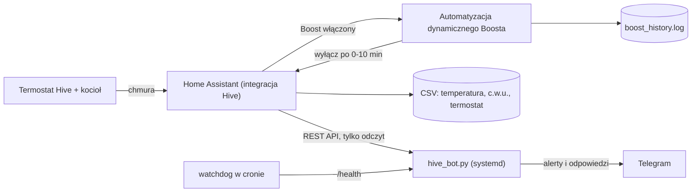

# Dynamiczna kontrola Boosta Hive dla Home Assistanta

**Przycisk Boost w Hive zawsze grzeje 30 minut — niezależnie od tego, ile jest w domu stopni.
Ten projekt sprawia, że Boost trwa tylko tyle, ile dom naprawdę potrzebuje, zapisuje każde
wciśnięcie i przysyła wiadomość na Telegramie, gdy w domu jest za ciepło.**


[English version: README.md](README.md)

---

## Skąd to się wzięło

W domu wielolokatorowym osoba, która wciska Boost, nigdy nie jest osobą, która płaci za gaz.
Hive daje jeden przycisk Boost i żadnej możliwości powiedzenia *„ale nie wtedy, gdy już jest
ciepło"* — przy 22 °C grzeje dokładnie tak samo chętnie jak przy 17 °C.

**Boost był wciskany przy 22,6 °C — cztery razy w pół godziny.** W domu było ciepło,
grzejniki i tak ruszyły, a aplikacja Hive nie oferowała niczego, co by to ograniczyło: żadnego
warunku, żadnego limitu temperatury, żadnego zapisu, kto to zrobił. Automatyzacja z tego repo
robi dokładnie to: powyżej progu Boost jest anulowany w kilka sekund, a poniżej czas zależy od
tego, jak zimno faktycznie jest. Każde wciśnięcie i każde anulowanie idzie do pliku, więc
miesiąc później nadal widać, co się działo.

**P.S. — co wyszło z logowania.** Ponieważ każdy Boost, każde okno ciepłej wody i próbka
temperatury co 15 minut lądują w zwykłym CSV, dane powiedziały to, czego termostat nigdy nie
pokazał: dom nagrzewał się zawsze wtedy, gdy kocioł grzał **ciepłą wodę**, przy całkowicie
wyłączonym centralnym ogrzewaniu. Stygnięcie zatrzymywało się dokładnie w chwili włączenia
c.w.u. i wracało po jej wyłączeniu — to podpis zaworu trójdrogowego przepuszczającego ciepło na
grzejniki. Żadna aplikacja, żaden termostat i żaden inteligentny harmonogram by tego nie
pokazał; pokazały to tylko logi. Jeśli rachunek za ogrzewanie wygląda dziwnie, logowanie jest
najtańszą diagnostyką, jaką można uruchomić — i to jest prawdziwy powód, dla którego loggery są
w tym repo.

## Co dostajesz

**Boost, który liczy się z temperaturą** — im cieplej w domu, tym krócej grzeje:

| Temperatura w pokoju | Boost trwa | Co się dzieje |
|---|---|---|
| poniżej 21 °C | 10 min | pełny cykl |
| 21 – 22 °C | 7 min | skrócony |
| 22 – 22,5 °C | 5 min | krótszy |
| 22,5 – 23 °C | 3 min | minimalny |
| 23 °C i więcej | brak | anulowany natychmiast |

**Bot Telegram, który pilnuje domu** — jeden alert przy przekroczeniu progu (nie jeden na
minutę), komendy z liczbami, które naprawdę są potrzebne, health check informujący, gdy Home
Assistant albo chmura Hive przestaje odpowiadać, i usługa systemd, żeby bot wracał po
restarcie. Tylko biblioteka standardowa: bez `pip`, bez virtualenva, bez kontenera.

Progi ostrzeżeń są zmierzone, nie wymyślone: Hive przysyła wartość tylko wtedy, gdy się zmieni,
więc spokojny dom wygląda identycznie jak milczący czujnik. Dlatego ostrzeżenie „odczyt nie
drgnął" czeka domyślnie 8 godzin — na 30 dniach prawdziwych danych próg 45 minut odezwałby się
87 razy w jednym tygodniu, za każdym razem bez powodu.

**Ślad na papierze** — jedna linia logu na każdą decyzję o Boost, próbka temperatury co 15 minut
i zapis, kto i kiedy zmieniał termostat. To właśnie zamienia rachunek za ogrzewanie z tajemnicy
w coś, o czym można dyskutować.

## Jak to wygląda

Prawdziwe wiadomości bota, na wymyślonych liczbach:

```text
🌡 Teraz w domu
Temperatura: 23,2 °C   (próg alertu 23,0 °C)
Cel termostatu: 21,0 °C
Grzejniki: GRZEJĄ (akcja Hive: heating)
Tryb ogrzewania: harmonogram
Ciepła woda: włączona
Odczyt z: 18:26 (4 min temu)
```

```text
🔥 Ogrzewanie — dziś (środa 14.01)

Razem: 1 h 25 min w 2 okresach
  • 06:30 – 07:12  (42 min)
  • 17:05 – 17:48  (43 min)
```

```text
⚡ Boosty — dziś (środa 14.01)

Ogrzewanie — 2 boosty:
  • 11:25 – 11:28 (3 min), przy 22,6 °C
  • 11:55 – 11:58 (3 min), przy 22,6 °C
Ciepła woda — 1 boost:
  • 11:25 – 11:39 (14 min)
```

Alert, z kontekstem, który go czyni użytecznym:

```text
🔥 Przekroczony próg temperatury
Dom: 23,4 °C   (próg 23,0 °C)
Godzina: 18:30
Cel termostatu: 21,0 °C
Grzejniki: nie grzeją
Ciepła woda: włączona
ℹ️ Grzejniki nie są wołane, a dom się nagrzewa — to wygląda na przeciek zaworu.
```

## Jak to jest połączone



Automatyzacja to jedyna część, która cokolwiek zmienia. Bot wyłącznie czyta.

## Szybki start

### Wariant A — tylko automatyzacja Boosta (około 5 minut)

1. Dodaj komendę logowania do `configuration.yaml`
   (wzór: [`homeassistant/configuration.example.yaml`](homeassistant/configuration.example.yaml)):

   ```yaml
   shell_command:
     boost_history_log: >
       bash -c 'echo "$(date "+%Y-%m-%d %H:%M:%S") - {{ message | regex_replace(find="[^\w \[\].,:;/()°=+>-]", replace="") }}" >> /config/boost_history.log'
   ```

2. Skopiuj [`homeassistant/automations/hive_boost_dynamic.yaml`](homeassistant/automations/hive_boost_dynamic.yaml)
   do swoich automatyzacji — jako plik przez `!include_dir_list`, albo wklejając treść w
   **Ustawienia → Automatyzacje → Utwórz → Edytuj w YAML**.

3. Sprawdź identyfikatory encji w **Narzędzia deweloperskie → Stany**. Domyślne to
   `binary_sensor.thermostat_1_boost`, `sensor.thermostat_1_current_temperature` i
   `climate.thermostat_1`.

4. **Narzędzia deweloperskie → YAML → Sprawdź konfigurację**, potem przeładuj automatyzacje.

5. Wciśnij Boost i zobacz `/config/boost_history.log`.

### Wariant B — automatyzacja i bot Telegram

Potrzebujesz tokena bota od [@BotFather](https://t.me/BotFather), własnego identyfikatora czatu
(zapytaj [@userinfobot](https://t.me/userinfobot)) i tokena długoterminowego Home Assistanta
(**profil → Bezpieczeństwo → Tokeny dostępu długoterminowego**).

Komendy krok po kroku są w [angielskim README](README.md#option-b--automation-and-the-telegram-bot).
Skrót: osobny użytkownik systemowy `hivebot`, pliki w `/opt/hive-bot`, `.env` z `chmod 600`,
`python3 hive_bot.py --check`, `systemctl enable --now hive-bot`, na końcu `/start` w Telegramie.

Aby bot mówił po polsku, ustaw w `.env`:

```ini
BOT_LANG=pl
BOT_TZ=Europe/London
```

## Komendy bota

| Komenda | Co odpowiada |
|---|---|
| `/temperatura` | temperatura teraz, cel termostatu, czy grzejniki grzeją, ciepła woda, wiek odczytu |
| `/ogrzewanie` | ile dziś grzały grzejniki, okres po okresie (`/ogrzewanie 7` = tydzień) |
| `/boosty` | każdy Boost z godziną, długością i temperaturą, przy której się zaczął |
| `/woda` | stan ciepłej wody, dzisiejsze okna, harmonogram słownie |
| `/dzis` | jeden ekran: min/max/średnia, ogrzewanie, boosty, ciepła woda, alerty |
| `/status` | health check bota, czas pracy, łączność z HA, wiek danych, próg, wyciszenie |
| `/prog 23` | pokaż lub zmień próg alertu |
| `/cicho 120` | wycisz alerty na 120 minut (1–1440) |
| `/glosno` | włącz alerty z powrotem |
| `/pomoc` | lista komend |

Angielskie nazwy komend działają jako aliasy. Cała warstwa tekstowa jest w jednym pliku,
[`telegram-bot/messages.py`](telegram-bot/messages.py).

## Co jeszcze jest w środku

[`homeassistant/packages/heating.yaml`](homeassistant/packages/heating.yaml) jest opcjonalny i
niezależny od automatyzacji Boosta:

- **harmonogram ciepłej wody** edytowalny w interfejsie, wykonywany na podgrzewaczu Hive,
- **cotygodniowy cykl antylegionella** (niedziela 02:00–04:00), niezależny od oszczędzania,
- **uzgodnienie stanu po restarcie**, żeby restart w środku okna nie zostawił kotła w losowym stanie,
- **loggery CSV**: temperatura co 15 minut, zdarzenia ciepłej wody, zmiany termostatu wraz z
  użytkownikiem, który je zrobił,
- **archiwum logu rdzenia Home Assistanta** po każdym restarcie — jedyny sposób, by zobaczyć,
  co działo się przed awarią.

## Bezpieczeństwo i prywatność

- **Legionella.** Woda przechowywana poniżej ~60 °C sprzyja legionelli. Cokolwiek ograniczasz,
  zostaw cykl, który raz w tygodniu przegrzewa cały zbiornik — po to jest niedzielna
  automatyzacja. Ona **włącza** ciepłą wodę, ale **nie podnosi** nastawy termostatu zbiornika —
  sprawdź osobno, że masz go na 60 °C lub więcej. W UK najemcy przysługuje ciepła woda, więc
  harmonogram to oszczędność, a nie wyłączenie.
- **To nie ogranicza ogrzewania.** Automatyzacja dotyka wyłącznie przycisku Boost. Harmonogram i
  temperatura docelowa termostatu zostają nietknięte.
- **Token Home Assistanta jest wszechwładny.** HA nie ma tokenów tylko do odczytu: token, którym
  bot jedynie czyta, pozwoliłby sterować całym domem. Trzymaj `.env` na `chmod 600` i rozważ
  osobne konto HA bez uprawnień administratora dla bota.
- **Wpisz swój identyfikator czatu.** Przy pustym `TELEGRAM_CHAT_ID` bota przejmuje pierwszy, kto
  napisze `/start`. `--check` ostrzega, jeśli go nie ustawiłeś.
- **Logi to dane o obecności.** Próbki temperatury i zdarzenia ciepłej wody pokazują, kiedy ktoś
  jest w domu. Zostają na Twojej maszynie — `.gitignore` trzyma `*.csv`, `*.log` i `state.json`
  poza gitem, a [`tools/check-secrets.sh`](tools/check-secrets.sh) skanuje drzewo, zmiany
  w indeksie i nowe commity przed pushem.

## Częste pytania

**Czy to ma sens bez domu wielolokatorowego?** Tak. Wystarczy dom, w którym Boost bywa wciskany
częściej, niż trzeba, albo w którym chcesz wiedzieć, co ogrzewanie faktycznie robiło.

**Czy bot coś zmienia w Home Assistancie?** Nie, tylko czyta stany i historię.

**Czy zadziała z termostatem innym niż Hive?** Bot tak — wystarczy wskazać własne encje przez
`BOT_ENTITY_*`. Automatyzacja woła `hive.boost_heating_off`, więc dla innej marki trzeba
podmienić to jedno wywołanie.

**Ile to oszczędza gazu?** Nie wiadomo i ten projekt nie będzie udawał, że wie. Bez odczytu
licznika gazu każda liczba byłaby wymyślona. Uczciwe stwierdzenie jest takie: Boost przestaje
grzać, kiedy w domu już jest ciepło, a Ty dostajesz log, na który można się powołać.

## Plany

- [ ] Zrzuty ekranu z Telegrama w README
- [ ] Opcjonalne podsumowanie tygodniowe
- [ ] Zabezpieczenie w automatyzacji: sprawdzić, czy Boost nadal trwa, przed wyłączeniem i zalogowaniem
- [ ] Odczyt licznika gazu, żeby oszczędności dały się zmierzyć, a nie zgadywać
- [ ] Więcej języków w `messages.py`

## Licencja

[MIT](LICENSE) — rób, co chcesz, bez gwarancji. Ogrzewanie w Twoim domu jest na Twoją
odpowiedzialność.
